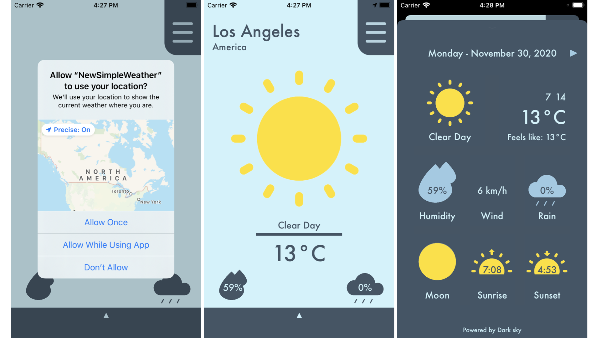
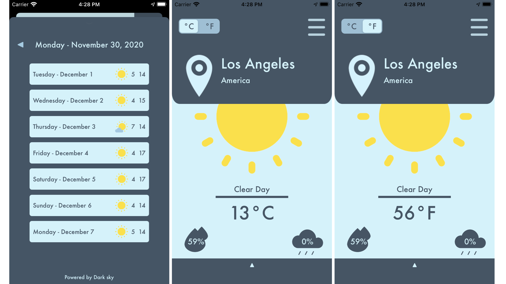
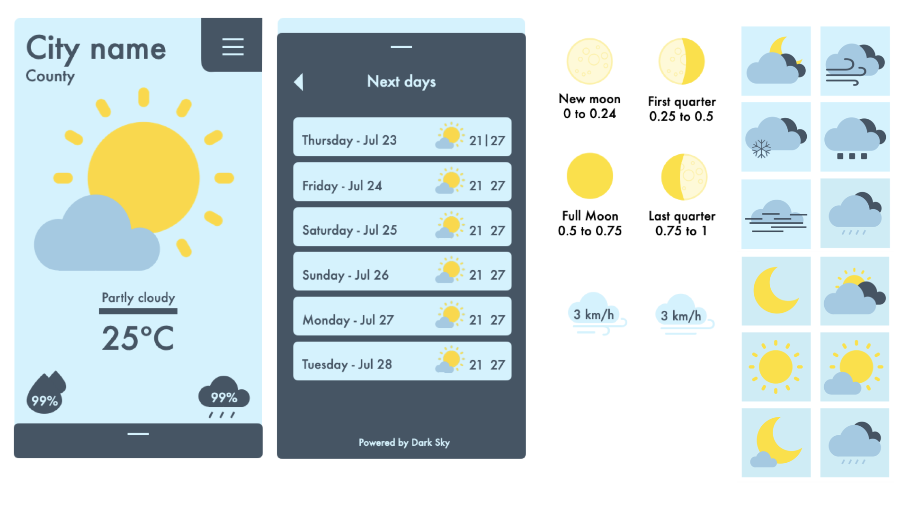

# Simple Weather
###### Version 1.0 - november 2020

This is a simple weather aplication that shows the weather of the place you currently are along with other informations as wind speed, rain, current moon state and when the sun will be up or down. You can also change between Celsius(°C) and Fahrenheit(°F)

## Table of contents
* [Features](#features)
* [Screenshots](#screenshots)
* [Design](#design)
* [Dark Sky API](#api)

     

### Features
- Made 100% in **Swift**;
- Using **MVC** Arquitecture;
- **Constraints** to work in different screen sizes;
- API request and json decoded natively using:
    - URLSession;
    - JSONDecoder;
    - Codable protocol for the models;

      

### Screenshots

      
     

### Design
The app idea was designed using **keynote**:

      
      
      

### Dark Sky API 
To learn more about Dark Sky API [click here](https://darksky.net/dev).
     
Since it uses an ID to identify who is requesting, **you will need to add your own before run the aplication (or it won't work).** It can be easily done by opening the "Contants" class and adding it to the **keyValue** constant, where you can find a comment that says "Add your own key here".

